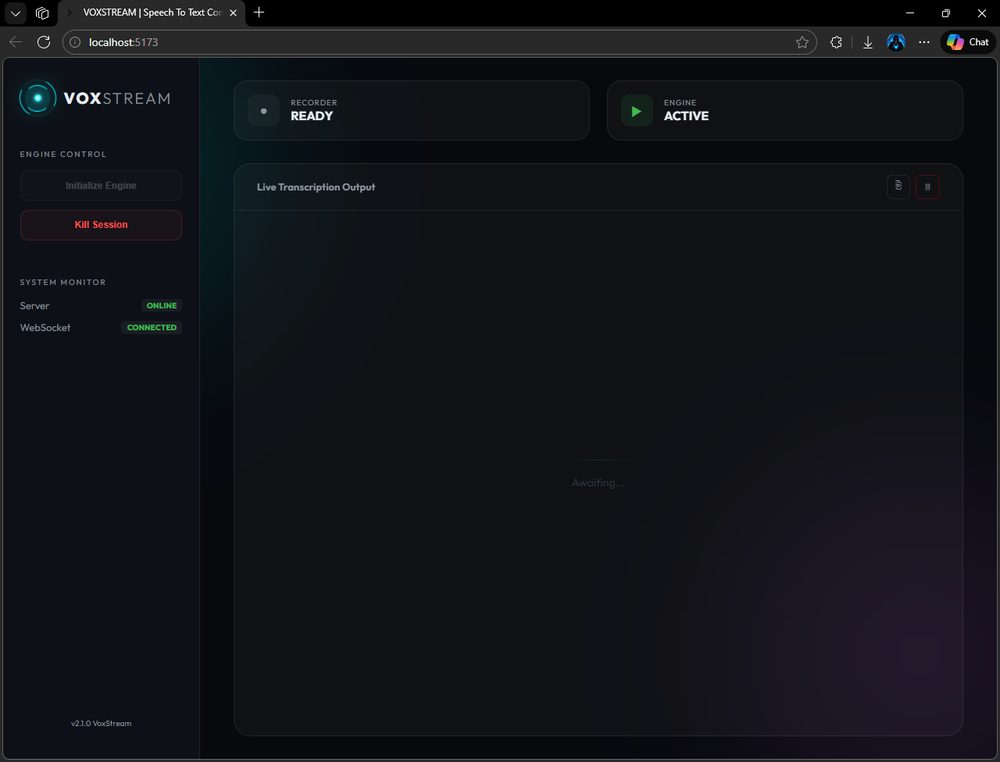

# VoxStream | Speech To Text Converter System

A state-of-the-art, real-time speech-to-text conversion system featuring a modern glassmorphism interface. This project leverages **FastAPI** on the backend and **React** on the frontend to provide a seamless, low-latency transcription experience.

## ✨ Features

- **Real-time Transcription**: Instant speech-to-text conversion with minimal latency using the `RealtimeSTT` library.
- **Modern UI/UX**: Premium glassmorphism design with a responsive layout, vibrant gradients, and smooth animations.
- **Live Status Monitoring**:
  - **LIVE**: A pulsing visual indicator showing active microphone recording.
  - **ENGINE READY**: Real-time status of the transcription engine.
- **WebSocket Streaming**: Persistent full-duplex communication for immediate text updates.
- **One-Click Clear**: Easily reset your transcription session.
- **Optimized for Performance**: Built with **Vite** and **FastAPI** for a fast, lightweight experience.

## 📸 Project Media

<p align="center">
  
</p>

## 🛠️ Technology Stack

### Backend

- **Python**: Core logic and processing.
- **FastAPI**: High-performance web framework for APIs and WebSockets.
- **RealtimeSTT**: Advanced audio-to-text recorder and processor.
- **Uvicorn**: ASGI server for running the backend.

### Frontend

- **React 19**: Modern UI component library.
- **Vite**: Ultra-fast build tool and development server.
- **Vanilla CSS**: Custom-built design system with modern typography (Outfit via Google Fonts).
- **WebSockets**: Real-time data synchronization.

## 🚀 Getting Started

### Prerequisites

- Python 3.10+
- Node.js & npm

### Installation

1. **Clone the repository**:

   ```bash
   git clone https://github.com/TitaniumCodeBench/VoxStream.git
   cd VoxStream
   ```

2. **Backend Setup**:

   ```bash
   # Create a virtual environment
   python -m venv .venv

   # Activate virtual environment (Windows)
   .\.venv\Scripts\activate

   # Install dependencies
   pip install -r backend/requirements.txt
   ```

3. **Frontend Setup**:
   ```bash
   npm install
   ```

### Configuration

The backend configuration is managed via `backend/config_.json`. You can specify the model and language:

```json
{
  "MODEL": "base.en",
  "LANGUAGE": "en"
}
```

### Running the Application

You can run both the frontend and backend concurrently with a single command:

```bash
npm start
```

- **Frontend**: [http://localhost:5173](http://localhost:5173)
- **Backend (FastAPI)**: [http://localhost:8000](http://localhost:8000)

## 📁 Project Structure

```text
STT_System/
├── backend/
│   ├── main.py            # FastAPI application & STT logic
│   ├── config_.json       # STT configuration (Model/Language)
│   └── requirements.txt   # Python dependencies
├── src/
│   ├── App.jsx            # Main React component
│   ├── App.css            # Modern glassmorphism styles
│   ├── index.css          # Main css styles
│   └── main.jsx           # React entry point
├── public/                # Static assets
├── index.html             # HTML entry point with Google Fonts
└── package.json           # Node.js dependencies and scripts
```

## 📝 License

This project is licensed under the MIT License.
